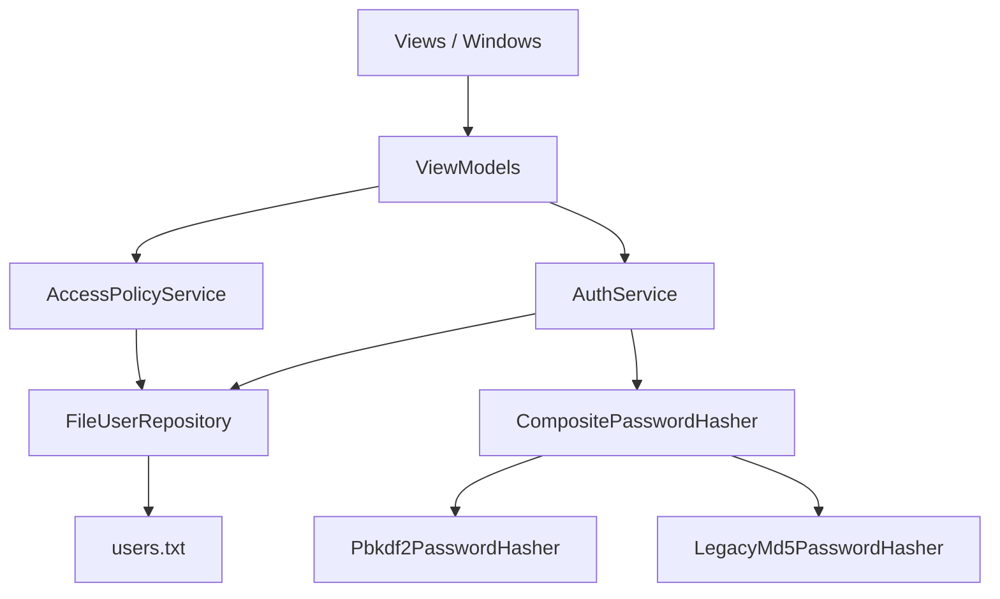

# Architecture

MyAdminExplorer is a WPF desktop application with role-based authentication and a restricted file explorer.

## High-level flow

## Windows

| Window | Purpose |
|--------|---------|
| `MainWindow` | Login |
| `AdminMain` | Admin dashboard |
| `ControlUser` | CRUD for users in `users.txt` |
| `AddUser` | Create restricted user |
| `Menu` | User menu (explorer, change password) |
| `Explorer` | Folder tree with forbidden paths |
| `EditForbidden` | Pick blocked folders |
| `ChangePass` | Password change dialog |

## Services

### FileUserRepository
Single source of truth for parsing and writing `users.txt`.

### AuthService
Validates credentials, upgrades legacy MD5 hashes to PBKDF2 on successful login, delegates schedule checks to `AccessPolicyService`.

### AccessPolicyService
Evaluates even/odd day rules and date/time access windows.

### CompositePasswordHasher
Verifies both PBKDF2 and legacy MD5 hashes; new passwords are always stored as PBKDF2.

## Infrastructure

- `AppPaths` — resolves application directory, ensures `users.txt` exists
- `FolderTreeHelper` — shared TreeView population logic for Explorer and EditForbidden
- `HeaderToImageConverter` — maps drive/folder headers to icons

## Testing strategy

Unit tests cover services only. WPF windows are exercised manually (smoke test).

## Future direction

See [decisions.md](decisions.md) — .NET 8 migration is planned but intentionally deferred to keep the portfolio artifact stable on .NET Framework 4.8.
